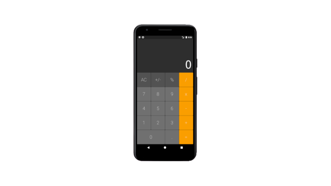

# iOS Calculator For Android

## Getting Started

This is a small application that simulates a iOS calculator for Android users.
To get stated with it clone the repo and run **Flutter pub get** on root then run **Flutter run**. If you use Android Studio or VS Code you can run the project directly from the IDE.

