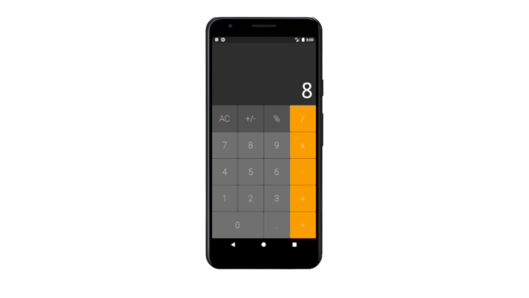

# iOS Calculator For Android

## Getting Started

This is a small application that simulates a iOS calculator for Android users.

  
     

To get stated with it clone the repo and run **Flutter pub get** on root then run flutter run. If you use Android Studio or VS Code you can run the project directly from the IDE.

